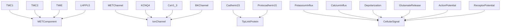
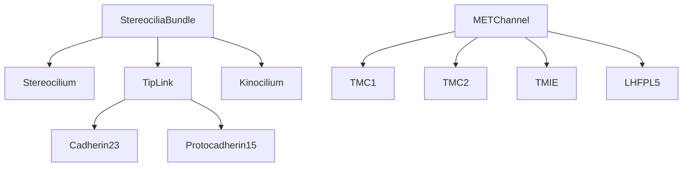
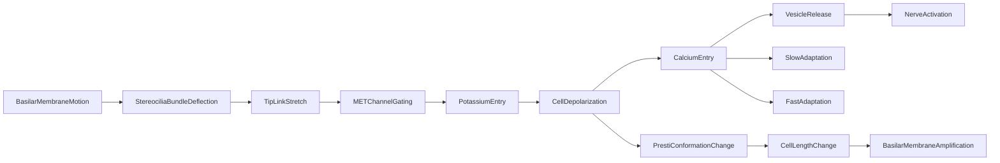

# Mechanotransduction -- Hair cell conversion of vibration to neural signals

Models the molecular and cellular machinery that converts basilar membrane motion into neural signals: stereocilia bundles, tip links (cadherin-23 / protocadherin-15), MET channels (TMC1/TMC2/TMIE/LHFPL5), ion channels (KCNQ4, CaV1.3, BKChannel), prestin, and the ion dynamics of the endocochlear potential. The mereology composes MET channels from their subunits and bundles from stereocilia and tip links. The causal graph traces BM motion through stereocilia deflection, tip-link stretch, MET channel gating, K+ influx, depolarization, Ca2+ entry, and vesicle release to nerve activation, with a parallel OHC electromotility loop (prestin → cell length change → basilar membrane amplification).

Key references:
- Hudspeth 1989: how the ear's works work
- Fettiplace & Kim 2014: physiology of mechanoelectrical transduction channels
- Pan et al. 2013: TMC1 and TMC2 are components of the MET channel
- Kawashima et al. 2011: TMC genes in hair cell mechanotransduction
- Zheng et al. 2000: prestin is the motor protein of outer hair cells
- Kubisch et al. 1999: KCNQ4 K+ channel in hair cells
- Dallos 1992: the active cochlea
- von Békésy 1952: endocochlear potential

## Entities (34)

| Category | Entities |
|---|---|
| Stereocilia structures (5) | Stereocilium, StereociliaBundle, TipLink, Kinocilium, CuticularPlate |
| Tip link proteins (2) | Cadherin23, Protocadherin15 |
| MET channel subunits (4) | TMC1, TMC2, TMIE, LHFPL5 |
| Ion channels (5) | METChannel, KCNQ4, CaV1_3, BKChannel, Prestin |
| Ions / messengers (3) | Potassium, Calcium, Glutamate |
| Potentials (2) | EndocochlearPotential, ReceptorPotential |
| Signal events (9) | StereociliaDeflection, TipLinkTension, METChannelOpening, PotassiumInflux, CalciumInflux, Depolarization, GlutamateRelease, ActionPotential, Electromotility, CochlearAmplification |
| Abstract (4) | METComponent, IonChannel, TipLinkProtein, CellularSignal |

## Taxonomy

## Mereology

## Causal graph

## Opposition

| Pair | Meaning |
|---|---|
| PotassiumInflux / CalciumInflux | Apical depolarizing current vs basal trigger for release |
| Electromotility / ActionPotential | OHC mechanical output vs IHC neural output |

## Qualities

| Quality | Type | Description |
|---|---|---|
| RestingPotential | f64 (mV) | EndocochlearPotential +80, Potassium -90, Calcium 131 |
| TipLinkLength | f64 (nm) | Cadherin23 170, Protocadherin15 37, TipLink 207 |
| ChannelConductance | f64 (pS) | METChannel/TMC1 150, KCNQ4 10, BKChannel 250 |
| IsOHCSpecific | bool | Prestin, Electromotility, CochlearAmplification |

## Axioms

| Axiom | Description | Source |
|---|---|---|
| BundleContainsTipLinkProteins | Stereocilia bundle transitively contains cadherin-23 and protocadherin-15 | standard |
| TMCsAreMETComponents | TMC1 and TMC2 are components of the MET channel | Pan et al. 2013 |
| TipLinkProteins | Cadherin-23 and protocadherin-15 are tip link proteins | standard |
| BMMotionCausesNerveActivation | Basilar membrane motion transitively causes nerve activation | Hudspeth 1989 |
| DepolarizationCausesElectromotility | Cell depolarization causes prestin conformational change in OHC | Zheng et al. 2000 |
| EndocochlearPotentialIsPositive | Endocochlear potential is positive (+80 mV) | von Békésy 1952 |
| PrestiIsOHCSpecific | Prestin is specific to outer hair cells | Zheng et al. 2000 |

Plus the auto-generated structural axioms from `define_ontology!`.

## Functors

Outgoing:

| Functor | Target | File |
|---|---|---|
| TransductionToPsychoacoustics | psychoacoustics | `../psychoacoustics/transduction_functor.rs` |
| TransductionToNeuroscience | auditory_neuroscience | `../auditory_neuroscience/transduction_functor.rs` |
| TransductionToVestibular | vestibular | `../vestibular/transduction_functor.rs` |

Incoming:

| Functor | Source | File |
|---|---|---|
| AnatomyToTransduction | anatomy | `anatomy_functor.rs` |

See [Compose via functor](../../../../../../docs/use/compose-via-functor.md) to add more.

## Files

- `ontology.rs` -- `TransductionEntity`, taxonomy, mereology, causal graph, opposition, qualities, 7 domain axioms, tests
- `anatomy_functor.rs` -- Functor from the anatomy ontology (anatomical structure → molecular role)
- `mod.rs` -- Module declarations
