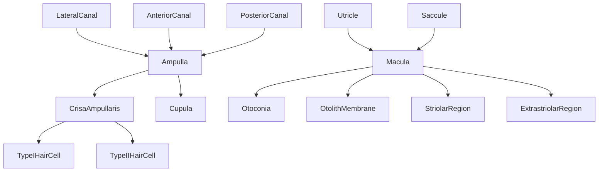
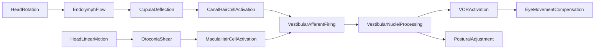

# Vestibular System -- Balance and spatial orientation

Models the balance and spatial orientation system that shares the inner ear with the cochlea, using the same hair cell transduction machinery but detecting head rotation (semicircular canals) and linear acceleration / gravity (otolith organs). Entities cover the three semicircular canals, the utricle and saccule, macula and crista ampullaris, Type I/II hair cells with calyx and bouton endings, vestibular nuclei, the three vestibular reflexes (VOR, VSR, VCR), stimulus types, and common vestibular disorders.

Key references:
- Goldberg et al. 2012: *The Vestibular System* (Oxford)
- Angelaki & Cullen 2008: vestibular system multisensory integration
- Rabbitt et al. 2004: semicircular canal biomechanics
- Fernández & Goldberg 1971: vestibular afferent physiology
- Hudspeth & Corey 1977: hair cell transduction in bullfrog sacculus

## Entities (40)

| Category | Entities |
|---|---|
| Semicircular canals (3) | LateralCanal, AnteriorCanal, PosteriorCanal |
| Canal structures (3) | Ampulla, Cupula, CrisaAmpullaris |
| Otolith organs (6) | Utricle, Saccule, Macula, Otoconia, OtolithMembrane, StriolarRegion, ExtrastriolarRegion |
| Hair cells (4) | TypeIHairCell, TypeIIHairCell, CalyxEnding, BoutonEnding |
| Neural pathway (7) | VestibularNerve, ScarpaGanglion, VestibularNuclei, MedialVestibularNucleus, LateralVestibularNucleus, SuperiorVestibularNucleus, CerebellumVestibular |
| Reflexes (3) | VestibuloOcularReflex, VestibuloSpinalReflex, VestibuloColicReflex |
| Stimuli (4) | AngularAcceleration, LinearAcceleration, GravityVector, HeadTilt |
| Disorders (3) | BPPV, VestibularNeuritis, Vertigo |
| Abstract (5) | SemicircularCanal, OtolithOrgan, VestibularHairCell, VestibularReflex, VestibularStimulus, VestibularDisorder |

## Taxonomy

```mermaid
graph TD
    LateralCanal --> SemicircularCanal
    AnteriorCanal --> SemicircularCanal
    PosteriorCanal --> SemicircularCanal
    Utricle --> OtolithOrgan
    Saccule --> OtolithOrgan
    TypeIHairCell --> VestibularHairCell
    TypeIIHairCell --> VestibularHairCell
    VestibuloOcularReflex --> VestibularReflex
    VestibuloSpinalReflex --> VestibularReflex
    VestibuloColicReflex --> VestibularReflex
    AngularAcceleration --> VestibularStimulus
    LinearAcceleration --> VestibularStimulus
    GravityVector --> VestibularStimulus
    HeadTilt --> VestibularStimulus
    BPPV --> VestibularDisorder
    VestibularNeuritis --> VestibularDisorder
    Vertigo --> VestibularDisorder
```

## Mereology

## Causal graph

## Opposition

| Pair | Meaning |
|---|---|
| AngularAcceleration / LinearAcceleration | Canal stimulus vs otolith stimulus |
| TypeIHairCell / TypeIIHairCell | Calyx afferent vs bouton afferent |
| VestibuloOcularReflex / VestibuloSpinalReflex | Gaze stabilization vs postural stabilization |

## Qualities

| Quality | Type | Description |
|---|---|---|
| TimeConstant | f64 (s) | Cupula / LateralCanal 6, VestibularNuclei 17 |
| VORGain | f64 | VestibuloOcularReflex 1.0 |
| CanalSensitivity | &'static str | Lateral yaw, Anterior pitch, Posterior roll |

## Axioms

| Axiom | Description | Source |
|---|---|---|
| ThreeCanals | Three semicircular canals are classified | Goldberg et al. 2012 |
| TwoOtolithOrgans | Utricle and saccule are otolith organs | standard |
| RotationCausesVOR | Head rotation transitively causes eye movement compensation | standard |
| CanalsContainHairCells | Semicircular canals transitively contain Type I and Type II hair cells | standard |
| ThreeDistinctCanalPlanes | Each canal is sensitive to a distinct plane | Rabbitt et al. 2004 |
| VORGainIsUnity | Ideal VOR gain is 1.0 | Goldberg et al. 2012 |

Plus the auto-generated structural axioms from `define_ontology!`.

## Functors

No outgoing functors yet.

Incoming:

| Functor | Source | File |
|---|---|---|
| AnatomyToVestibular | anatomy | `../anatomy/vestibular_functor.rs` |
| TransductionToVestibular | transduction | `transduction_functor.rs` |

See [Compose via functor](../../../../../../docs/use/compose-via-functor.md) to add more.

## Files

- `ontology.rs` -- `VestibularEntity`, taxonomy, mereology, causal graph, opposition, qualities, 6 domain axioms, tests
- `transduction_functor.rs` -- Functor from the transduction ontology (shared hair cell machinery)
- `mod.rs` -- Module declarations
