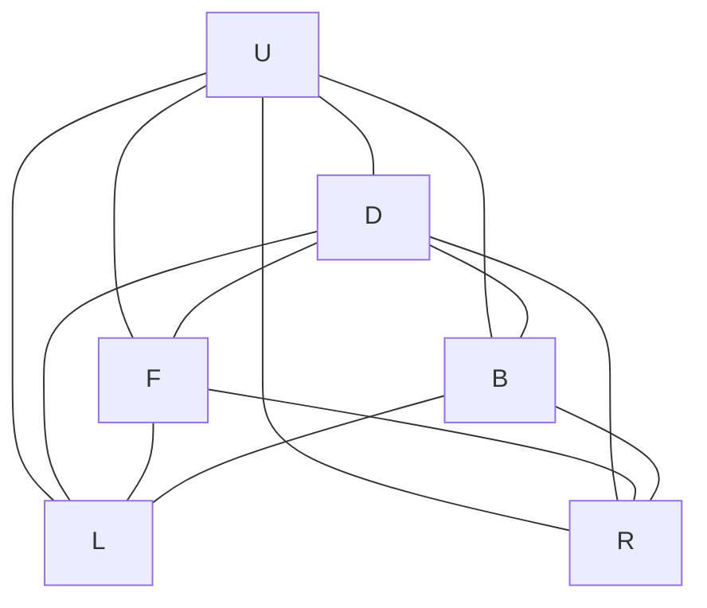

# Rubik -- Rubik's Cube Ontology

Models the 3×3×3 Rubik's cube as a thin category over its six faces, with rich cube state carried through qualities. Invariants of a valid cube state — centers fixed to their face color and nine stickers per color — are proven as domain axioms.

Key references:
- Rubik 1975 (original Magic Cube patent)
- Joyner 2008: *Adventures in Group Theory* (cube group and move notation)
- Singmaster 1981: *Notes on Rubik's Magic Cube*

## Entities (6)

| Category | Entities |
|---|---|
| Faces (6) | U, D, F, B, L, R |

The `Color` enum (White, Yellow, Green, Blue, Red, Orange) is not an ontology entity — it is data carried by the cube-state qualities.

## Category

Defined via `define_ontology!` as `RubikCategory { concepts: Face, relation: FaceRotation }`. It is a thin category — one morphism per (source, target) pair — giving a fully connected graph over the six faces.

## Qualities

| Quality | Type | Description |
|---|---|---|
| FaceIndex | usize | Canonical ordinal for each face: U=0, D=1, F=2, B=3, L=4, R=5 |
| CenterColor | Color | Color of the center sticker of a face on a given `Cube` |

## Axioms (2)

| Axiom | Description | Source |
|---|---|---|
| CentersFixed | Center stickers must match their face color | Singmaster 1981 |
| NinePerColor | Each color must have exactly nine stickers | Rubik 1975 |

Plus the auto-generated structural axioms from `define_ontology!`.

## Functors

No cross-domain functors yet — see [Compose via functor](../../../../../../docs/use/compose-via-functor.md) to add one.

## Files

- `ontology.rs` -- `RubikCategory`, `RubikOntology`, `FaceIndex`/`CenterColor` qualities, `CentersFixed`/`NinePerColor` axioms, tests
- `face.rs` -- `Face` entity and `Color` with face-color mapping
- `cube.rs` -- `Cube` state with 54 stickers, apply/get methods
- `moves.rs` -- `Move` (R, U, F, L, D, B and their inverses)
- `engine.rs` -- runtime cube engine / action loop
- `tests.rs` -- additional tests beyond `ontology.rs`
- `mod.rs` -- module declarations
