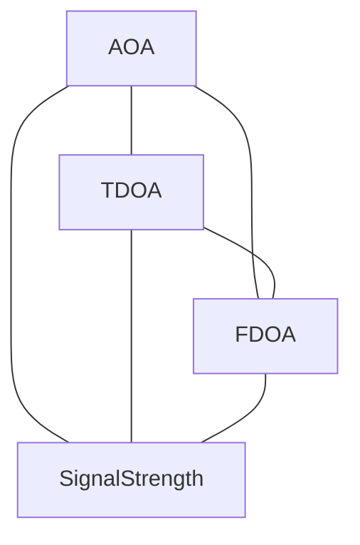

# Electronic Warfare -- Emitter Geolocation Observables Ontology

Models the observable types used in emitter geolocation — angle of arrival, time difference of arrival, frequency difference of arrival, and received signal strength — as a fully connected fusion category. The category reflects that any subset of observables may be combined to refine an emitter location estimate.

Key references:
- Poisel 2012: *Electronic Warfare Target Location Methods*
- Joint Publication 3-13.1 *Electronic Warfare*
- Torrieri 1984: *Statistical Theory of Passive Location Systems*

## Entities

| Category | Entities |
|---|---|
| Observables (4) | AOA, TDOA, FDOA, SignalStrength |

## Category

Defined via `define_ontology!` as `EwCategory { concepts: EwObservable, relation: EwFusionRelation }`. The category is fully connected: any observable may be fused with any other.

## Qualities

| Quality | Type | Description |
|---|---|---|
| ObservableGeometry | &'static str | Geometric locus for each observable: AOA = line of bearing, TDOA = hyperbola, FDOA = hyperbola, SignalStrength = circle |

## Axioms (2)

| Axiom | Description | Source |
|---|---|---|
| AoaBounded | Angle of arrival measurements lie in [-π, π] | Poisel 2012 |
| TdoaRequiresSensorPair | TDOA geolocation requires at least one sensor pair | Poisel 2012 |

Plus the auto-generated structural axioms from `define_ontology!`.

## Functors

No cross-domain functors yet — see [Compose via functor](../../../../../../docs/use/compose-via-functor.md) to add one.

## Files

- `ontology.rs` -- `EwObservable`, `EwCategory`, `EwOntology`, `ObservableGeometry` quality, `AoaBounded`/`TdoaRequiresSensorPair` axioms, tests
- `engine.rs` -- runtime EW fusion engine
- `tests.rs` -- additional tests beyond `ontology.rs`
- `mod.rs` -- module declarations
