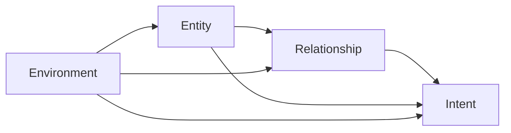

# Situation -- JDL Level 2 Situation Assessment Ontology

Models the elements of a military situation assessment — entities, relationships, intent, and environment — as a category whose morphisms encode the JDL assessment-dependency chain: entity identification must precede relationship assessment, which precedes intent inference, with environment informing every level.

Key references:
- Steinberg & Bowman 2008: *Revisions to the JDL Data Fusion Model*
- Llinas & Hall 2001: *Introduction to Multi-Sensor Data Fusion*
- Endsley 1995: *Toward a Theory of Situation Awareness in Dynamic Systems*

## Entities

| Category | Entities |
|---|---|
| Situation elements (4) | Entity, Relationship, Intent, Environment |

## Category

`SituationCategory` has `SituationElement` as objects and `AssessmentDependency` as morphisms. The edge set encodes the JDL chain plus environment's information role; composition is restricted to declared edges so non-chain paths cannot be synthesised.

## Qualities

| Quality | Type | Description |
|---|---|---|
| JdlLevel | &'static str | Maps each element to its JDL processing level (Level 0/1 for Environment, Level 1 for Entity, Level 2 for Relationship and Intent) |

## Axioms (2)

| Axiom | Description | Source |
|---|---|---|
| EntityIdentificationFirst | Situation assessment requires entity identification first (Level 1 before Level 2) | Steinberg & Bowman 2008 |
| IntentRequiresRelationship | Intent inference requires prior relationship assessment | Llinas & Hall 2001 |

Plus the auto-generated structural axioms from category laws.

## Functors

No cross-domain functors yet — see [Compose via functor](../../../../../../docs/use/compose-via-functor.md) to add one.

## Files

- `ontology.rs` -- `SituationElement`, `AssessmentDependency`, `SituationCategory`/`SituationOntology`, `JdlLevel` quality, `EntityIdentificationFirst`/`IntentRequiresRelationship` axioms, tests
- `engine.rs` -- runtime situation-assessment engine
- `tests.rs` -- additional tests beyond `ontology.rs`
- `mod.rs` -- module declarations
