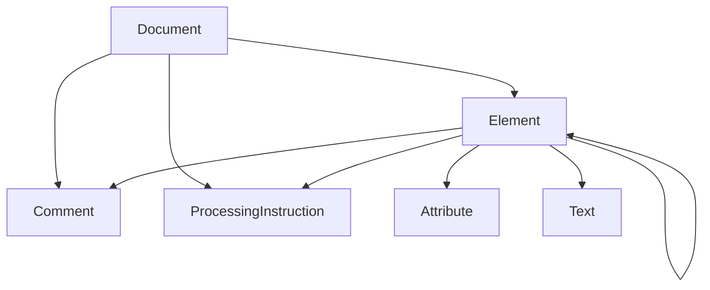

# Markup -- Universal Markup Ontology

Models what markup IS — independent of any specific markup language — as a containment category over the six universal node kinds: Document, Element, Attribute, Text, Comment, ProcessingInstruction. Specific markup languages (XML, HTML, SGML) are extensions of this base; the `xml` submodule is the first concrete realization.

Key references:
- Coombs, Renear & DeRose 1987: *Markup Systems and the Future of Scholarly Text Processing*
- Goldfarb 1990: *The SGML Handbook*
- DeRose et al. 1990: *What is Text, Really?*

## Entities

| Category | Entities |
|---|---|
| Node kinds (6) | Document, Element, Attribute, Text, Comment, ProcessingInstruction |

## Category

`MarkupCategory` has `NodeKind` as objects and `Contains` as morphisms. The edge set encodes the universal mereology of a markup document: `Document` may contain Elements, Comments, and ProcessingInstructions; `Element` may contain Elements, Attributes, Text, Comments, and ProcessingInstructions; transitive closure adds `Document → Attribute`, `Document → Text`, `Document → ProcessingInstruction`.

## Qualities

| Quality | Type | Description |
|---|---|---|
| CanContainChildren | () | Document and Element can contain children; Attribute, Text, Comment, ProcessingInstruction cannot |

## Axioms (1)

| Axiom | Description | Source |
|---|---|---|
| WellFormedDocument | A well-formed markup document has exactly one root element | Goldfarb 1990; W3C XML 1.1 2008 |

Plus the auto-generated structural axioms from category laws. A runtime check `is_well_formed` validates concrete `MarkupNode` trees.

## Functors

No cross-domain functors yet — see [Compose via functor](../../../../../../docs/use/compose-via-functor.md) to add one. The `xml` submodule is an extension of this base markup ontology.

## Files

- `ontology.rs` -- `NodeKind`, `Contains`, `MarkupCategory`, `MarkupOntology`, `MarkupNode` rich type, `CanContainChildren` quality, `WellFormedDocument` axiom, `is_well_formed` checker, tests
- `xml/` -- XML extension (W3C XML 1.1) and its sub-ontologies (LMF, OWL, RDF)
- `tests.rs` -- additional tests beyond `ontology.rs`
- `mod.rs` -- module declarations
