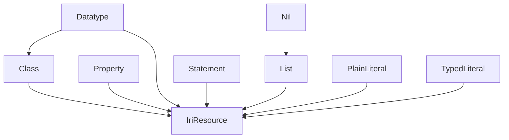

# RDF -- W3C RDF 1.1 and RDFS 1.1 Ontology

Models the RDF abstract syntax as a category over ten node kinds — IRI resources, blank nodes, plain and typed literals, reified statements, classes, properties, datatypes, the nil list terminator, and lists. The RDFS built-in taxonomy and W3C well-formedness axioms (literals cannot be subjects, predicates must be properties) are enforced as domain axioms.

Key references:
- W3C RDF 1.1 Concepts and Abstract Syntax (2014)
- W3C RDF Schema 1.1 (2014)
- W3C RDF 1.1 Semantics (2014)
- Hayes 2004: *RDF Semantics*

## Entities

| Category | Entities |
|---|---|
| Node kinds (10) | IriResource, BlankNode, PlainLiteral, TypedLiteral, Statement, Class, Property, Datatype, Nil, List |

## Category

`RdfCategory` has `RdfNodeKind` as objects and `RdfRelation` as morphisms. Identity morphisms exist for every kind; non-identity morphisms connect each valid subject kind to every valid object kind, reflecting RDF's abstract-syntax constraint that only literals and `Nil` are excluded from subject position.

## RDFS built-in taxonomy

## Qualities

| Quality | Type | Description |
|---|---|---|
| CanBeSubject | () | Every non-literal, non-nil node kind — IriResource, BlankNode, Class, Property, Datatype, Statement, List |

## Axioms (2)

| Axiom | Description | Source |
|---|---|---|
| LiteralsCannotBeSubjects | RDF literals cannot appear in subject position | W3C RDF 1.1 §3 |
| PredicatesMustBeProperties | RDF predicates must be IRI references (rdf:Property) | W3C RDF 1.1 §3 |

Plus the auto-generated structural axioms from category laws.

## Functors

No cross-domain functors yet — see [Compose via functor](../../../../../../../../docs/use/compose-via-functor.md) to add one. RDF is the natural target of a forgetful functor from the sibling `owl` ontology.

## Files

- `ontology.rs` -- `RdfNodeKind`, `RdfRelation`, `RdfCategory`/`RdfOntology`, `rdfs_taxonomy`, `RdfVocabulary` (canonical RDF/RDFS IRIs), `CanBeSubject` quality, `LiteralsCannotBeSubjects`/`PredicatesMustBeProperties` axioms, tests
- `tests.rs` -- additional tests beyond `ontology.rs`
- `mod.rs` -- module declarations
