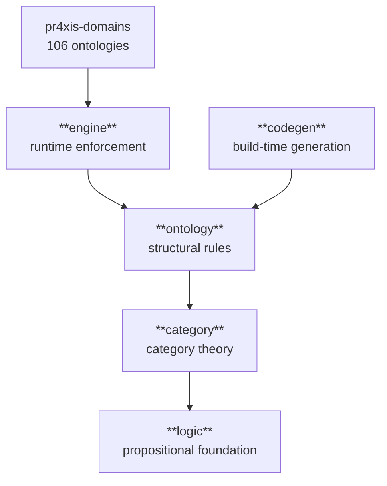
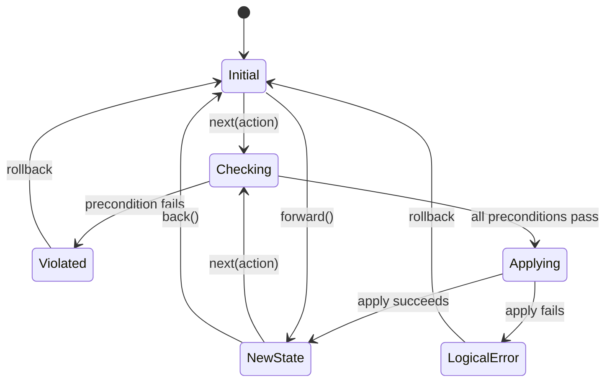
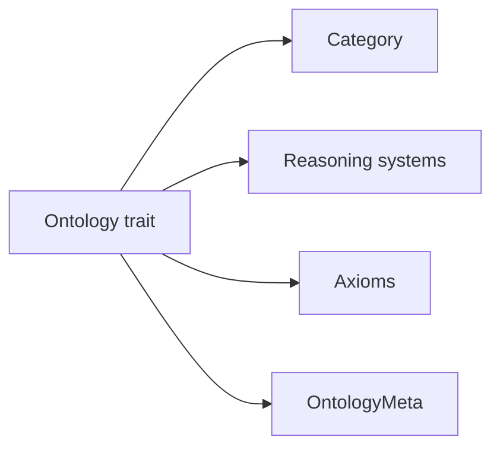

# Architecture

pr4xis is a five-layer Rust stack where each layer depends only on the layers below it. Domain knowledge lives in composable ontologies, not in mechanical processing logic — there is no parser-with-special-cases, no rule-engine-with-hardcoded-strings, no if-statements branching on domain values.

This document covers the abstract structure. For specific ontologies — what concepts they contain, what they connect to, what their adjunction discoveries look like — see the per-ontology READMEs ([#57](https://github.com/i-am-logger/pr4xis/issues/57)) and the per-ontology diagrams ([#59](https://github.com/i-am-logger/pr4xis/issues/59)).

## The five layers



The layer count and module layout are verifiable by `ls crates/pr4xis/src/` — exactly five top-level modules: `category`, `codegen`, `engine`, `logic`, `ontology`.

### `pr4xis::logic` — propositional foundation

Depends on nothing. Provides axioms, propositions, logical composition (`AllOf`, `AnyOf`, `Not`, `Implies`), the three modes of inference (deduction, induction, abduction), and the classical connectives with truth tables. Verified by `cargo test -p pr4xis logic`.

### `pr4xis::category` — category theory primitives

Depends on logic. Provides entities, relationships, categories, morphisms, functors, natural transformations, adjunctions, and the algebraic structures used throughout the stack: `Writer` monad (for tracing), `Monoid`, `Semigroup`, `Applicative`, `NonEmpty`, `Cofree` comonad, `Algebra` (F-algebras and recursion schemes), `Lens`. Validation functions verify category laws (identity, associativity, closure) exhaustively and via [property-based testing](https://en.wikipedia.org/wiki/Software_testing#Property_testing). Verified by `cargo test -p pr4xis category`.

### `pr4xis::ontology` — structural rules

Depends on category and logic. Defines what things ARE and how they relate. The `Ontology` trait bundles a category, qualities, structural axioms, and domain axioms. The `define_ontology!` macro is the declarative entry point — author an entity enum and a relation enum, and the macro emits the category implementation, all the reasoning systems (taxonomy, mereology, causation, opposition), structural axioms (no cycles, antisymmetric, weak supplementation, etc.), and the `OntologyMeta` used by the engine for trace attribution. Verified by `cargo test -p pr4xis ontology`.

### `pr4xis::engine` — runtime enforcement

Depends on ontology, category, and logic. Defines how things CHANGE.



A new `next()` after `back()` clears the redo stack and starts a new branch from that point. Verified by `cargo test -p pr4xis test_back_forward_roundtrip` and `cargo test -p pr4xis test_next_after_back_clears_future`.

### `pr4xis::codegen` — declarative ontology data delivery

Depends on ontology. The mechanism for getting authoritative ontology data into the runtime. The layer name is `codegen` after the build-time path, but **codegen is one of several delivery options** — all of them are functors from the same `OntologyBuilder` source category, with categorical equivalence proven so that the choice between them is operational rather than semantic.

- **Build-time codegen** — the reference instance is `codegen::wordnet`, which converts the WordNet XML dictionary into a compiled English ontology of ~107K concepts emitted as static Rust. This is the path the WASM browser demo uses, so the browser never has to parse 100K WordNet entries at startup.
- **Runtime async loading** — load ontology data from a file or stream asynchronously at runtime, materializing the same `OntologyBuilder` structure the codegen path produces.
- **Memory-mapped files** — mmap a precomputed ontology binary directly into memory, getting the data without parsing or copying.

All three produce the same ontology because each is a verified functor from the same source. The choice depends on deployment: build-time codegen for static binaries, async loading for hot reloading or for ontologies too large to embed, mmap for very large ontologies that need to share memory across processes.

## The Ontology trait

Every ontology in pr4xis is a category plus the reasoning systems that operate on it. The `define_ontology!` macro emits all of them in a single declarative block, including the metadata used for trace attribution.



The reasoning systems available to every ontology are:

- **Taxonomy** — `is-a` hierarchies (`NoCycles`, `Antisymmetric`)
- **Mereology** — part-whole relationships (`WeakSupplementation`)
- **Causation** — causal DAGs (`NoSelfCausation`)
- **Opposition** — symmetric, irreflexive opposition pairs
- **Context** — disambiguation by context (`ContextDef`, `resolve`)
- **Analogy** — structure-preserving maps between ontologies (functors as Analogies)

For what each looks like in a specific domain, see the per-ontology README. For the broader composition story — how ontologies talk to each other through proven functors and how adjunctions detect missing distinctions — see [Concepts](concepts.md).

## Domain organization

```
crates/domains/src/
├── formal/        — math, information, calculator, meta (ontology diagnostics)
├── applied/       — sensor fusion, navigation, perception, tracking, space, underwater,
│                    industrial, localization, theming
├── social/        — games, software (HTTP, XML, OWL, RDF, LMF), judicial, compliance, military
├── natural/       — physics, biomedical, hearing, geodesy, colors, music
└── cognitive/     — linguistics, cognition (epistemics, metacognition)
```

Total: 106 ontologies (`find crates/domains/src -name ontology.rs | wc -l`).

## Design decisions

**Domain knowledge lives in composable ontologies.** There is no parser-with-special-cases, no rule-engine-with-hardcoded-strings, no if-statements branching on domain values. Every domain is an ontology; every ontology is encoded as Rust code that the type system checks; every claim is a theorem with a proof.

**Situations are immutable.** Every action produces a new situation. The old one is preserved in the history stack. This enables undo, redo, and branching without mutation.

**Preconditions are separate from apply.** The precondition layer validates rules; the apply function transforms state. They are checked independently, so a precondition failure never partially applies a state change.

**EngineError returns the engine.** Both `Violated` and `LogicalError` return the engine so the caller can rollback. The system never panics — contradictions are data, not crashes.

**Rich enums carry context.** Every enum variant carries the data of HOW it got there. No information is lost between state transitions.

**Property-based testing is the primary verification.** Domain invariants are expressed as properties that hold for all generated inputs, not just hand-picked examples.

**The pipeline is a writer monad.** Tracing is not a separate concern bolted onto computations; pipelines are built as `Writer<PipelineTrace, A>` so trace entries accumulate via monoid composition rather than mutation.

## Related

- [README](../../README.md) — the project's main entry point and pitch
- [Concepts](concepts.md) — what ontologies are and how they compose via functors
- [Foundations](foundations.md) — academic lineage; every ontology traced to its source paper
- Per-ontology READMEs and citings — pending [#57](https://github.com/i-am-logger/pr4xis/issues/57)
- Per-ontology diagrams ("neural network of an ontology") — pending [#59](https://github.com/i-am-logger/pr4xis/issues/59)
- Source-of-truth report pipeline (live numbers from CI) — pending [#60](https://github.com/i-am-logger/pr4xis/issues/60)

---

- **Document date:** 2026-04-14
- **Verification:** every claim in this document is verifiable by `ls crates/pr4xis/src/`, `find crates/domains/src -name ontology.rs`, or one of the cited `cargo test` commands.
